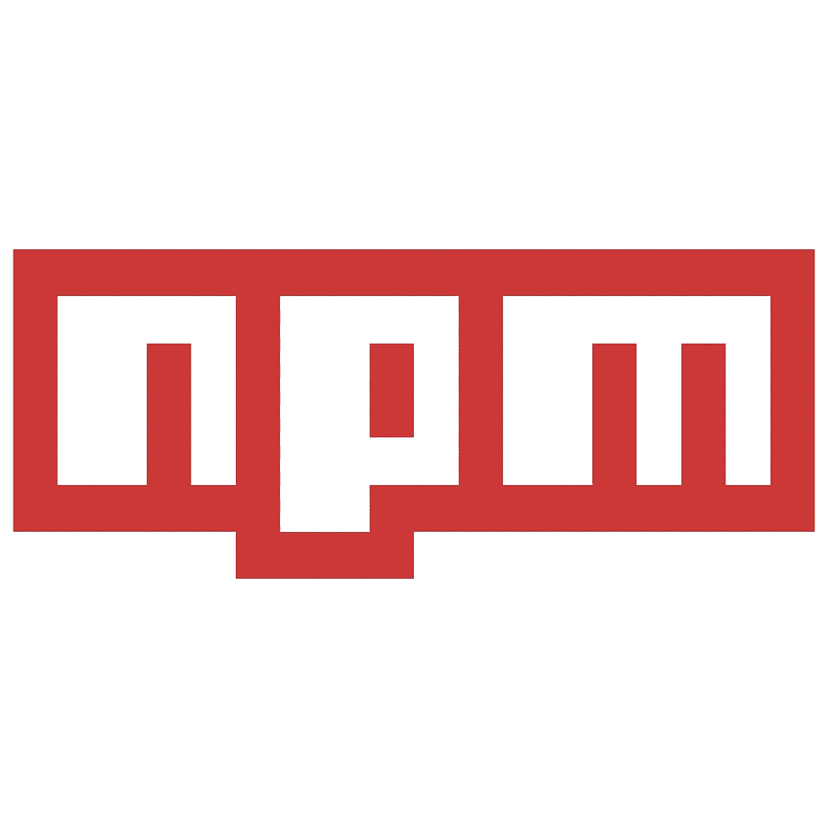

# Hi, 👋 my name is Max, I am Frontend Developer

## About Me

I'm a passionate web developer with a strong foundation in JavaScript and React. My journey into the world of programming began with a keen interest in web development, and since then, I've been on an exciting learning curve, constantly honing my skills and exploring new technologies.

## Experience

🚀 I have hands-on experience working on commercial projects where I've leveraged my expertise in JavaScript and React to bring website designs to life. Collaborating closely with designers and other team members, I've been involved in every stage of the development process, from concept to deployment.

👨‍💻 During my academic journey, I actively participated in team projects, taking on various roles such as team leader, scrum master, and developer. These experiences not only strengthened my technical abilities but also taught me the importance of effective communication, teamwork, and agile methodologies.

**Technologies:**

**Working with:**

**Learning:**

**Contacts:**

## Career Goals

🎯 My ultimate goal is to excel in frontend development, continuously pushing the boundaries of what's possible on the web. I thrive in environments where I can tackle new challenges, learn from my peers, and contribute my skills to impactful projects. Whether it's mastering the latest frontend frameworks or delving into UX design principles, I'm always eager to expand my knowledge and skill set.

<em><b>I love connecting with different people</b> so if you want to say <b>hi, I'll be happy to meet you more!</b> :)</em>

