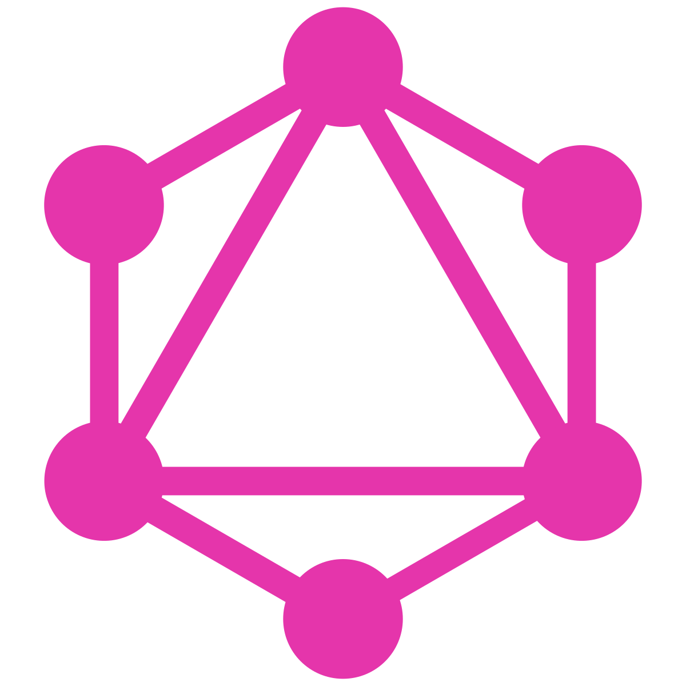

## About me 😊

I'm a passionate web developer with a strong foundation in TypeScript, React, and Node.js. I am particularly interested in participating in team projects and learning the latest technologies in web development.

  

    <table style="display:block;">
      <thead>
        <tr>
          <th>Category</th>
          <th>Technologies</th>
        </tr>
      </thead>
      <tbody>
        <tr>
          <td>Frontend</td>
          <td>
            
            
            
            
            
            
            
            
          </td>
        </tr>
        <tr>
          <td>Backend</td>
          <td>
            
            
            
            
            
            
            
            
          </td>
        </tr>
        <tr>
          <td>Tools</td>
          <td>
            
            
            
            
            
            
            
          </td>
        </tr>
        <tr>
          <td>Other</td>
          <td>
            
            
            
            
          
           
                      
          </td>
        </tr>
        <tr>
          <td>Learn</td>
          <td>
            
            
          </td>
        </tr>
      </tbody>
    </table>
    
    
  

<h2>Experience</h2>

🚀 I have hands-on experience working on commercial projects where I used my knowledge of TypeScript and React to bring website designs to life. There are also team and pet projects, which you can check out below.

👨‍💻 During my studies, I actively participated in team projects, using the aforementioned technologies to implement front-end and back-end solutions. This experience not only strengthened my technical abilities but also taught me the importance of effective communication, teamwork, and agile methodologies.

  
  
  

<h2 style="margin-bottom: 0;">Career Goals</h2>

🎯 My ultimate goal is to succeed in full-stack development while constantly pushing the boundaries of what's possible on the web. I thrive in an environment where I can take on new challenges, learn from my colleagues, and use my skills on projects. At the moment, I want to learn the Next.js and Nest frameworks, as well as relational databases.

<em>I love connecting with different people, so I'll be happy to meet you!</em> 😊

  

Сontacts

  
  
  
  

