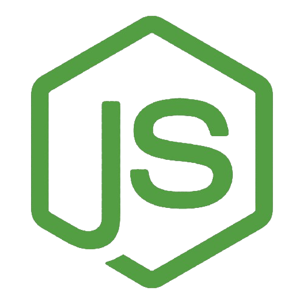

# Hi, 👋 my name is Max, I am Full stack Developer

## About Me

I'm a passionate web developer with a strong foundation in TypeScript, React, and Node.js. I am particularly interested in participating in team projects and learning the latest technologies in web development.

## Experience

🚀 I have hands-on experience working on commercial projects where I used my knowledge of TypeScript and React to bring website designs to life. There are also team and pet projects, you can check them out below.

👨‍💻 During my studies, I actively participated in team projects, used the above-mentioned technologies to implement front-end and back-end. This experience not only strengthened my technical abilities but also taught me the importance of effective communication, teamwork, and agile methodologies.

| Category     | Technologies                                                                                                                                                                                                                                                                                                                                                                                                                                                                                     |
| ------------ | ------------------------------------------------------------------------------------------------------------------------------------------------------------------------------------------------------------------------------------------------------------------------------------------------------------------------------------------------------------------------------------------------------------------------------------------------------------------------------------------------ |
| **Frontend** |       |
| **Backend**  |                                                                                                                                  |
| **Tools**    |                                                                                                                                                       |
| **Other**    |                                                                                                                                                                                                                                                   |
| **Learn**    |                                                                                                                                                                |

**Contacts:**

  
  
  

## Career Goals

🎯 My ultimate goal is to succeed in full-stack development while constantly pushing the boundaries of what's possible on the web. I thrive in an environment where I can take on new challenges, learn from my colleagues, and use my skills on projects. At the moment, I want to learn the Next.js and Nest frameworks, as well as relational databases.

<em>I love connecting with different people so I'll be happy to meet you more!</em> 😊

  

