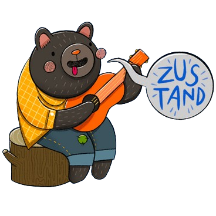

<h1>Hi there, I'm Max</h1> 
Full stack Developer

<h2>Experience</h2>

🚀 I have hands-on experience working on commercial projects where I used my knowledge of TypeScript and React to bring website designs to life. There are also team and pet projects, you can check them out below.

👨‍💻 During my studies, I actively participated in team projects, used the above-mentioned technologies to implement front-end and back-end. This experience not only strengthened my technical abilities but also taught me the importance of effective communication, teamwork, and agile methodologies.

  <table style="display=block;">
    <thead>
      <tr>
        <th>Category</th>
        <th>Technologies</th>
      </tr>
    </thead>
    <tbody>
      <tr>
        <td>Frontend</td>
        <td>
          
          
          
          
          
          
        </td>
      </tr>
      <tr>
        <td>Backend</td>
        <td>
          
          
          
          
        </td>
      </tr>
      <tr>
        <td>Tools</td>
        <td>
          
          
          
          
        </td>
      </tr>
      <tr>
        <td>Other</td>
        <td>
          
          
          
        </td>
      </tr>
      <tr>
        <td>Learn</td>
        <td>
          
          
          
          
        </td>
      </tr>
    </tbody>
  </table>
  

##

Сontact me

  
  
  

## Career Goals

🎯 My ultimate goal is to succeed in full-stack development while constantly pushing the boundaries of what's possible on the web. I thrive in an environment where I can take on new challenges, learn from my colleagues, and use my skills on projects. At the moment, I want to learn the Next.js and Nest frameworks, as well as relational databases.

<em>I love connecting with different people so I'll be happy to meet you more!</em> 😊

  

